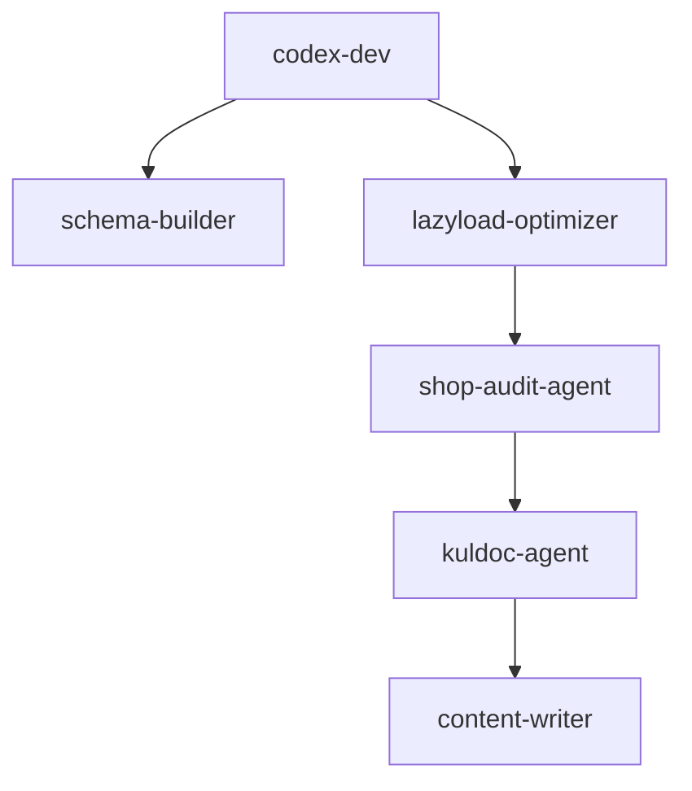

# 🤖 KUL KID – AGENTS.md

## Overview
This document defines the active and planned **AI agents** integrated into the KUL KID Shopify development workflow.
Each agent has a specific scope, communication layer, and associated prompt protocols designed for **Codex**, **Shopify CLI**, and **KUL KID compliance automation**.

The goal is to maintain a clear, modular architecture for autonomous and semi-autonomous processes that support the project’s lifecycle — from content generation to code optimization and compliance monitoring.

---

## 🧠 Core Agents

### 1. `codex-dev`
**Role:** Primary code execution and theme refactoring assistant  
**Scope:** Liquid, CSS, JS, JSON schema generation for Shopify blocks and sections  
**Triggers:** `/prompt codex` blocks in commits or PR comments  
**Inputs:** Theme files (`.liquid`, `.json`, `.css`, `.js`)  
**Outputs:** Inline code suggestions, new schema sections, or complete block refactors  
**Linked directories:** `/sections`, `/snippets`, `/assets`, `/config`

---

### 2. `kuldoc-agent`
**Role:** Documentation and compliance synchronization  
**Scope:** Maintains alignment with **KUL KID Company Compliance**, product safety notes, GPSR disclaimers, and EU labeling  
**Triggers:** Commits to `/docs/` or `/products/` directories  
**Outputs:** Auto-updated disclaimers, schema notes, SEO tags  
**Linked directories:** `/docs`, `/products`, `/templates`

---

### 3. `lazyload-optimizer`
**Role:** Performance and Lighthouse optimization advisor  
**Scope:** Adds lazy loading attributes, minifies assets, checks render-blocking elements  
**Triggers:** Mentions of “lazy load” or “performance fix” in commits or PRs  
**Linked directories:** `/snippets`, `/sections`, `/assets`

---

### 4. `schema-builder`
**Role:** Schema generation and manual selection automation  
**Scope:** Adds or updates schema selectors for pages, collections, and manual link groups  
**Triggers:** `@schema`, `manual selector`, or `comprehensive-footer` keywords  
**Linked directories:** `/sections`, `/blocks`

---

### 5. `content-writer`
**Role:** SEO-optimized product and collection text generation  
**Scope:** Uses KUL KID brand voice and `PRODUCT_TEMPLATE_v3.8`  
**Triggers:** Uploaded screenshots of Shopify product/collection pages  
**Linked directories:** `/products`, `/content`, `/locales`

---

### 6. `shop-audit-agent`
**Role:** QA and compliance validation before deploy  
**Scope:** Validates schema links, theme structure, accessibility, meta fields  
**Triggers:** Manual run before pushing to `main`  
**Outputs:** `AUDIT_REPORT.md` with validation results and improvement notes

---

## ⚙️ Optional / Planned Agents
| Agent | Role | Status |
|-------|------|--------|
| `ai-marketer` | Generates Klaviyo flow templates and campaign drafts | Planned |
| `asset-checker` | Detects unused or broken assets | In setup |
| `image-gen-agent` | Creates hero or product mockups based on prompts | Optional |
| `copy-validator` | Checks texts against brand tone and compliance | Planned |

---

## 🔗 Inter-Agent Dependencies

---

## 📂 Directory Mapping

| Directory    | Agent(s) Responsible                          | Description                    |
| ------------ | --------------------------------------------- | ------------------------------ |
| `/sections`  | codex-dev, schema-builder, lazyload-optimizer | Liquid sections & schema logic |
| `/snippets`  | codex-dev, lazyload-optimizer                 | Includes & partials            |
| `/assets`    | lazyload-optimizer                            | CSS/JS/media optimization      |
| `/docs`      | kuldoc-agent                                  | Compliance & documentation     |
| `/products`  | content-writer, kuldoc-agent                  | Product text & metadata        |
| `/templates` | content-writer, schema-builder                | Description + schema templates |

---

## 🧩 Agent Workflow Example

**Example:** Updating `blocks/comprehensive-footer.liquid`

1. Developer creates PR with `@prompt codex`
2. `codex-dev` suggests schema selector addition
3. `schema-builder` generates JSON schema for manual category selection
4. `kuldoc-agent` syncs updated schema into compliance notes
5. `shop-audit-agent` validates changes pre-push

---

## 🪶 Author Notes

This repo and agent framework are maintained by **Nesheim & Vatten AS** for **KUL KID**.
All AI integrations run in **manual trigger mode** only — no autonomous write access to main branch.

---

© 2025 Nesheim & Vatten AS – All rights reserved.
